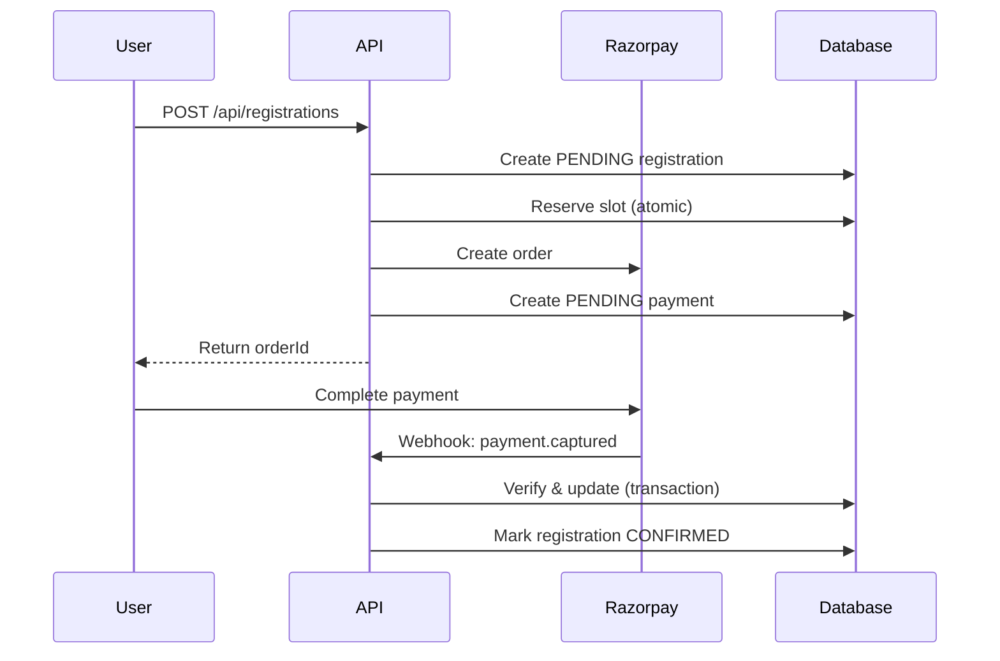

# Sports Fest Backend API Documentation

Production-grade backend for Rishihood University Sports Fest Platform.

## Tech Stack

- **Framework**: Next.js 16 (App Router)
- **Database**: PostgreSQL (production) / SQLite (development)
- **ORM**: Prisma 7 with driver adapters
- **Auth**: NextAuth v4 with role-based access
- **Payments**: Razorpay integration

---

## Quick Start

```bash
# Install dependencies
npm install

# Setup environment
cp .env.example .env
# Edit .env with your credentials

# Generate Prisma client
npx prisma generate

# Push schema to database
npx prisma db push

# Seed database (optional)
npm run db:seed

# Start dev server
npm run dev
```

---

## Environment Variables

| Variable | Required | Description |
|----------|----------|-------------|
| `DATABASE_URL` | Yes | PostgreSQL connection string |
| `NEXTAUTH_URL` | Yes | App URL (e.g., http://localhost:3000) |
| `NEXTAUTH_SECRET` | Yes | Random 32+ char secret |
| `RAZORPAY_KEY_ID` | Yes | Razorpay API key ID |
| `RAZORPAY_KEY_SECRET` | Yes | Razorpay API key secret |
| `RAZORPAY_WEBHOOK_SECRET` | Yes | Webhook signature secret |
| `GOOGLE_CLIENT_ID` | No | OAuth client ID |
| `GOOGLE_CLIENT_SECRET` | No | OAuth client secret |

---

## API Endpoints

### Public Routes

| Method | Endpoint | Description |
|--------|----------|-------------|
| GET | `/api/sports` | List all active sports |
| GET | `/api/sports/[slug]` | Get sport details |
| GET | `/api/colleges` | List all colleges |

### Auth Required

| Method | Endpoint | Description |
|--------|----------|-------------|
| POST | `/api/registrations` | Create registration + order |
| GET | `/api/registrations` | List user's registrations |
| POST | `/api/payments/verify` | Verify frontend payment |
| POST | `/api/payments/create-order` | Retry failed payment |
| GET | `/api/user/profile` | Get user profile |
| GET | `/api/user/registrations` | Get user registrations |

### Admin Only

| Method | Endpoint | Description |
|--------|----------|-------------|
| POST | `/api/admin/sports` | Create sport |
| PATCH | `/api/admin/sports/[id]` | Update sport |
| DELETE | `/api/admin/sports/[id]` | Delete sport |
| POST | `/api/admin/sports/toggle` | Open/close registration |
| GET | `/api/admin/registrations` | List all registrations |
| GET | `/api/admin/export` | Export CSV |
| POST | `/api/admin/payments/manual` | Confirm offline payment |
| GET | `/api/admin/stats` | Dashboard statistics |

### Webhooks

| Method | Endpoint | Description |
|--------|----------|-------------|
| POST | `/api/webhooks/razorpay` | Payment webhook |

---

## Payment Flow



---

## Security Features

- ✅ Timing-safe signature verification
- ✅ Optimistic locking for slot reservation
- ✅ Idempotent webhook handling
- ✅ Role-based access control
- ✅ Input validation with Zod
- ✅ XSS sanitization
- ✅ Transaction-safe operations
- ✅ Audit logging

---

## Deployment Checklist

- [ ] Set production DATABASE_URL
- [ ] Configure Razorpay production keys
- [ ] Set NEXTAUTH_SECRET (secure random)
- [ ] Configure webhook URL in Razorpay dashboard
- [ ] Run `npx prisma migrate deploy`
- [ ] Verify HTTPS is enabled
- [ ] Test webhook with Razorpay test mode
